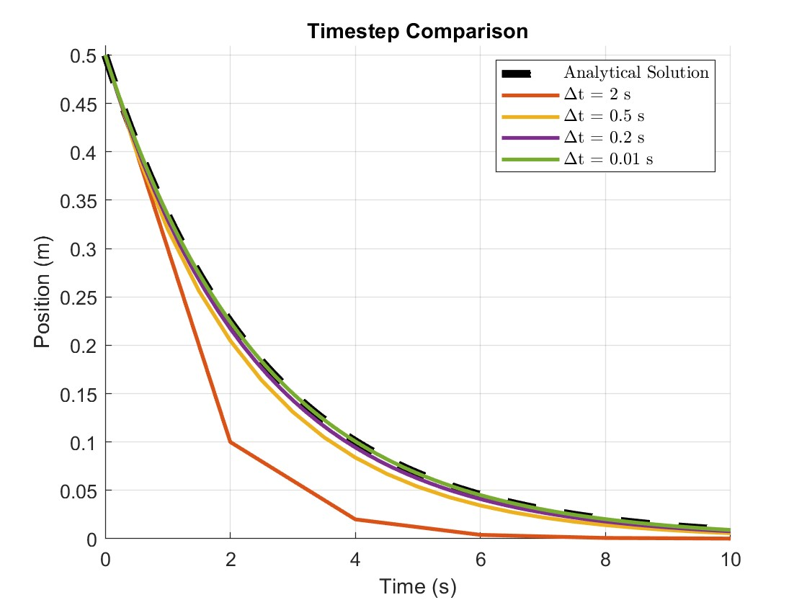

---
Name: Kyle Petitt
Topic: 33
Title: Accuracy and Stability of Different Types of Time-Stepping Methods
----

# Accuracy and Stability of Different Types of Time-Stepping Methods
In numerical analysis, time-stepping methods are one of the most fundamental forms of numerical integration. These methods are commonly used to integrate time-dependent ordinary differential equations (ODEs) and partial differential equations (PDEs) \cite{xxxx}. They are approximate methods that are dependent on user parameters and model properties, but can be used to approximate the behavior of a variety of systems with high fidelity if applied correectly. They are especially useful for integrating systems with no analytical solution, and are often used in industry and research. This wiki will serve to provide an introduction to the accuracy and stability of such methods, but a more in-depth study is left to the reader. Only first-order, ordinary differential equation initial-value problems (IVPs) will be discussed directly, although these methods can be applied to higher order systems and a range of conditions.

## Background
These methods are seperated into two primary categories, explicit and implicit. Explicit methods approximate the state of the system at a later time based off of the state of the system at the current time. Given the differential equation and an initial condition, the algorithm can compute the next system-state over and over one step at a time. This is also commonly referred to as "time-marching." The algorithm is commonly written as 

$$x(t+\Delta t) = F(x(t))$$

where $F$ can be calculated directly (example shown later) and $x_i$ is known from the initial condition or previous time step computation. Since all of the terms on the right side of the equation are known, the next system-state can be directly computed.

Implicit methods, on the other hand, look to find the next system-state by solving an equation using the current state and next state. These values are then computed simultaneously, and typically via numerical methods as they are usually nonlinear in nature. This algorithm is typically written as 

$$G(x(t),x(t+\Delta t)) = 0$$

Numerical methods are commonly needed to solve for $x(t+\Delta t)$ in the implicit case, which adds an additional and often expensive step to the process. This may seem like a roundabout way to find the next system state when compared to the explicit method, but the implicit method has its merits which will be discussed in subsepquent sections.

## Derivation
To understand these numerical methods a bit better, the derivations are key. First we will look at the simplest form of the explicit method using a first-order, ordinary differential equation of form

$$\dot{x} = -0.4x$$

This can be rewritten as

$$\frac{dx}{dt} = -0.4x$$

For a sufficently small $\Delta t$, this can be rewritten as

$$\Delta x \approx -0.4x\Delta t$$

which is equvalent to

$$\Delta x \approx \dot{x}\Delta t$$

This gives the approximate change in $x$ per time step $\Delta t$, so the next state of the system can be computed directly. The next state and is thus approximately

$$x(t+\Delta t) \approx x(t)+\Delta x$$

which is equvalent to our final form

$$x(t+\Delta) \approx \frac{dx}{dt}\Delta t + x(t)$$

which is Forward Euler's integration. Note that this method depends heavily on the size of $\Delta t$, which is chosen by the user. Intuitively, as the size of $\Delta t$ is decreased, the accuracy of the approximation increases, which will be discussed later. Unfortunately this increase in accuracy, has a side-effect, a direct increase in run time.

XXX Derivation of implicit method

## Accuracy and Stabillity
The accuracy and stability of these two methods

Implicit is unconditionally stable

## Example and Sample Code
Consider the same first-order, ordinary differential equation as before.

$$\dot{x} = -0.4x$$

This ODE can be solved analytically yielding the equation

$$x(t) = x_0e^{-0.4t}$$

where $x_0$ is the given initial condition. Using Forward Euler integration

$$x_{i+1} = \dot{x}_i\Delta t + x_i$$

and varying the value of $\Delta t$, we can produce this plot showing how the size of $\Delta t$ can directly affect the accuracy of the integration.

We see by inspection that this algorithm is only useful for sufficiently small time steps. As the size of the time step is decreased, the approximation converges to the analytical solution.

## "Why they are what they are"

## Fringe Cases
Stiff systems

## Implicit-Explicit Method (IMEX)

## Applications

## Summary

## References

1. https://en.wikipedia.org/wiki/Explicit_and_implicit_methods
2. https://www.fidelisfea.com/post/time-integration-methods-for-implicit-and-explicit-fea-what-are-they-and-how-do-they-work
3. https://fncbook.github.io/fnc/ivp/overview.html
4. Here
5. Like
6. This
7. Bryngelson, S. H., & Freund, J. B. (2018). Global stability of flowing red blood cell trains. Physical Review Fluids, 3(7). https://doi.org/10.1103/physrevfluids.3.073101 
